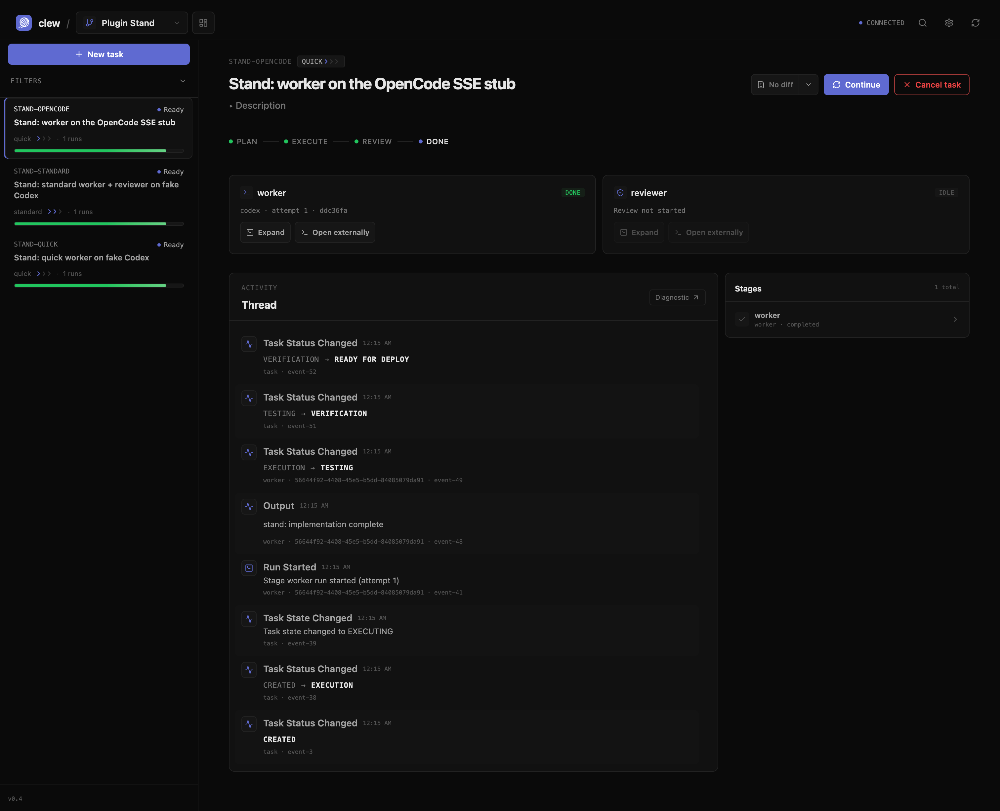

# Clew

> Локальный task-centric control plane для разработки с AI-агентами.
>
> **Язык / Language:** [Русский (по умолчанию)](#russian) · [English](#english)

<a id="russian"></a>

## Русский

### Что такое Clew

Clew связывает привычные coding harnesses — Codex, OpenCode и будущие адаптеры — с устойчивым жизненным циклом задачи. Агент пишет код и работает с инструментами, а Clew хранит цель, попытки, worktree, проверки, ревью, решения человека и итоговый результат.

Коротко: **агент выполняет работу, Clew держит нить задачи от первого запуска до принятия результата.**



<p align="center"><sub>Пример интерфейса: worker, reviewer, этапы выполнения и причинная история событий.</sub></p>

### Зачем это нужно

Обычная сессия агента заканчивается вместе с окном терминала. Разработка — нет: задачу нужно продолжить после сбоя, проверить на конкретной ревизии, показать изменения, повторить неудачный этап или попросить человека принять решение.

Clew добавляет над нативным агентом именно этот слой координации:

- **Задача вместо эфемерного чата.** Цель, критерии приёмки, запуски, сообщения и решения сохраняются в одном Task Thread.
- **Нативные harnesses вместо нового «агента».** Codex и OpenCode сохраняют свои инструменты, сессии, approvals и контекст.
- **Изоляция вместо случайных изменений.** Запуски работают в управляемых Git worktrees и связываются с ревизией, попыткой и evidence.
- **Проверяемый результат вместо красивого ответа.** `READY` появляется только при наличии нужных проверок; `COMPLETED` остаётся решением человека.
- **Продолжение вместо ручного восстановления.** Можно продолжить задачу, повторить этап, открыть изменения, посмотреть историю или создать follow-up.

### Что уже умеет Clew

| Возможность          | Что получает разработчик                                                                          |
| -------------------- | ------------------------------------------------------------------------------------------------- |
| Долгоживущие задачи  | Цель, acceptance criteria, статусы, события, сообщения и история запусков                         |
| Codex и OpenCode     | Единая точка запуска через нативные Codex App Server и OpenCode Server                            |
| Профили выполнения   | `quick`, `standard` и `deep` с разным уровнем планирования, ревью и контроля                      |
| Git worktrees        | Изолированное рабочее пространство для каждого запуска и понятная связь с commit SHA              |
| Проверки и ревью     | Command evidence, pinned verification, структурированное ревью и ограниченные retries             |
| Task Screen и CLI    | Локальный daemon, Web UI, Task Thread, просмотр изменений, история и диагностические команды      |
| Local-first и Runner | Работа на одной машине или выполнение стадий на одном настроенном Runner-хосте                    |
| Операционные данные  | Экспорт результата, безопасная очистка, usage/cost-данные и опциональная OpenTelemetry-телеметрия |

### Как проходит задача

```text
Task
  ↓
Scout / Plan (опционально)
  ↓
Worker: Codex или OpenCode
  ↓
Checks + evidence
  ↓
Review и bounded retry
  ↓
READY
  ↓
Решение человека: continue / complete / follow-up
```

Профиль выбирает глубину процесса:

| Профиль    | Когда использовать                       | Что происходит                                                                          |
| ---------- | ---------------------------------------- | --------------------------------------------------------------------------------------- |
| `quick`    | Небольшая задача или быстрый эксперимент | Один worker без обязательного отдельного ревью                                          |
| `standard` | Обычная фича или исправление             | Worker, структурированное ревью и ограниченный retry                                    |
| `deep`     | Большая или рискованная задача           | Архитектор, schema-valid DAG, approval gate, параллельные worktrees, интеграция и ревью |

### Быстрый старт

#### Требования

- macOS или Linux;
- Node.js 22.5 или новее;
- Git 2.30 или новее;
- для native flows — Codex CLI `0.148.0` и/или OpenCode CLI/server `1.18.23`.

Windows пока не проходил проверку для этой версии.

#### Установка и проверка

```sh
git clone https://github.com/IgorJin/Clew.git
cd Clew
npm ci
npm run check
node bin/clew.js --help
```

#### Первый запуск без внешних credentials

Выполните команды в Git-репозитории, где уже есть хотя бы один commit:

```sh
node /path/to/Clew/bin/clew.js init

node /path/to/Clew/bin/clew.js task create \
  --id DEMO-1 \
  --title "First Clew task" \
  --description "Prove task-centric execution" \
  --accept "the fixture verification passes" \
  --profile quick

node /path/to/Clew/bin/clew.js run DEMO-1 --harness fake
node /path/to/Clew/bin/clew.js status DEMO-1
node /path/to/Clew/bin/clew.js events DEMO-1
```

`fake` — детерминированный harness для demo и тестов; аккаунт провайдера не нужен. Состояние хранится в `.clew/clew.sqlite`, а управляемые worktrees — в `.clew/worktrees/`.

#### Подключение Codex или OpenCode

Сначала проверьте границу совместимости:

```sh
node /path/to/Clew/bin/clew.js doctor --harness codex
node /path/to/Clew/bin/clew.js doctor --harness opencode
```

Затем выберите адаптер явно:

```sh
node /path/to/Clew/bin/clew.js run DEMO-1 --harness codex
node /path/to/Clew/bin/clew.js run DEMO-1 --harness opencode
```

OpenCode должен быть запущен отдельно, обычно так:

```sh
opencode serve --hostname 127.0.0.1 --port 4096
```

Codex работает через `codex app-server` по JSON-RPC stdio. Одного сообщения о завершении недостаточно: для состояния `READY` Clew ожидает хотя бы один успешный command-evidence.

### Команды, которые нужны чаще всего

| Задача                           | Команда                                                          |
| -------------------------------- | ---------------------------------------------------------------- |
| Следить за статусом              | `node bin/clew.js status TASK --watch`                           |
| Открыть Task Thread              | `node bin/clew.js task thread TASK --follow`                     |
| Продолжить работу с сообщением   | `node bin/clew.js continue TASK --message "..."`                 |
| Посмотреть результат             | `node bin/clew.js task result TASK --human`                      |
| Посмотреть изменения             | `node bin/clew.js task open-changes TASK`                        |
| Повторить этап                   | `node bin/clew.js retry TASK worker --actor NAME --reason "..."` |
| Перепроверить конкретную ревизию | `node bin/clew.js verify TASK --revision SHA --actor NAME`       |
| Принять результат                | `node bin/clew.js complete TASK --revision SHA --actor NAME`     |
| Проверить worktrees              | `node bin/clew.js worktree list`                                 |

### Режимы эксплуатации

По умолчанию Clew работает локально: CLI, daemon, UI, хранилище и harness находятся на одной машине. `clew daemon start` поднимает loopback-only daemon и сообщает URL интерфейса.

Для разделения control plane и выполнения можно использовать один предварительно настроенный Runner:

```sh
node bin/clew.js daemon start
node bin/clew.js runner serve
node bin/clew.js run TASK --execution paired
```

Удалённые endpoints требуют `wss://`; `ws://` разрешён только для loopback. Runner не является кластерным scheduler: автоматического failover и нескольких Runner в текущей версии нет.

### Что Clew не делает

Clew — это не новая модель и не самостоятельный coding agent. Нативные harnesses отвечают за выбор инструментов, контекст, shell/browser behavior, approvals и редактирование; Clew отвечает за задачу, выполнение, evidence, ревью и принятие.

В текущей версии также нет multi-Runner scheduler, автоматического failover, PR/merge automation, автоматического разрешения merge conflicts или автоматического provisioning портов, баз данных и контейнеров.

### Документация

- [`DONE.md`](./DONE.md) — подробный русскоязычный usage guide и конкретные сценарии;
- [`docs/COMPATIBILITY.md`](./docs/COMPATIBILITY.md) — поддерживаемые версии и конфигурация;
- [`docs/TROUBLESHOOTING.md`](./docs/TROUBLESHOOTING.md) — диагностика типичных проблем;
- [`docs/UI.md`](./docs/UI.md) и [`docs/CONTROL-PLANE-V1.md`](./docs/CONTROL-PLANE-V1.md) — Web UI, API и WebSocket;
- [`docs/TASK-DATA-LIFECYCLE.md`](./docs/TASK-DATA-LIFECYCLE.md) — жизненный цикл данных задачи;
- [`VISION.md`](./VISION.md) — долгосрочное направление;
- [`ROADMAP.md`](./ROADMAP.md) — текущие релизные результаты и следующий план;
- [`RELEASE.md`](./RELEASE.md) — release gate и sign-off.

Подробнее о плагинах, Scout, Controller/Runner и операционных контрактах — в каталоге [`docs/`](./docs/).

### Лицензия

MIT. Публичное npm-имя `clew` принадлежит другому проекту, поэтому этот репозиторий распространяется через GitHub Releases и не публикуется в этот namespace.

[Перейти к English version ↓](#english)

<a id="english"></a>

## English

### What is Clew?

Clew connects familiar coding harnesses — Codex, OpenCode, and future adapters — to a durable task lifecycle. The agent writes code and uses tools; Clew keeps the goal, attempts, worktree, checks, review, human decisions, and final result together.

In one sentence: **the agent does the work; Clew keeps the thread from the first run to human acceptance.**

The screenshot above shows the task screen with a worker, reviewer, stages, and a causal event timeline.

### Why it exists

A normal agent session ends when its terminal or chat window ends. Software work does not: a task may need to resume after a failure, be verified against a specific revision, expose its changes, retry a failed stage, or wait for a human decision.

Clew adds that coordination layer above the native agent:

- **A task instead of an ephemeral chat.** Goals, acceptance criteria, runs, messages, and decisions live in one Task Thread.
- **Native harnesses instead of another agent loop.** Codex and OpenCode keep their own tools, sessions, approvals, and context.
- **Isolation instead of accidental edits.** Runs use managed Git worktrees and remain connected to a revision, attempt, and evidence.
- **Evidence instead of a polished answer.** `READY` requires the expected checks; `COMPLETED` remains a human decision.
- **Continuation instead of manual recovery.** Continue a task, retry a stage, inspect changes, read history, or create a follow-up.

### What Clew provides today

| Capability             | What you get                                                                       |
| ---------------------- | ---------------------------------------------------------------------------------- |
| Durable tasks          | Goals, acceptance criteria, statuses, events, messages, and run history            |
| Codex and OpenCode     | One launch surface for the native Codex App Server and OpenCode Server             |
| Execution profiles     | `quick`, `standard`, and `deep` with different planning, review, and control depth |
| Git worktrees          | Isolated workspaces for runs with explicit commit provenance                       |
| Checks and review      | Command evidence, pinned verification, structured review, and bounded retries      |
| Task Screen and CLI    | Local daemon, Web UI, Task Thread, change inspection, history, and diagnostics     |
| Local-first and Runner | One-machine execution or stage execution on one configured Runner host             |
| Operational data       | Result export, safe cleanup, usage/cost data, and optional OpenTelemetry traces    |

### How a task moves

```text
Task
  ↓
Scout / Plan (optional)
  ↓
Worker: Codex or OpenCode
  ↓
Checks + evidence
  ↓
Review and bounded retry
  ↓
READY
  ↓
Human decision: continue / complete / follow-up
```

Choose a profile based on the amount of control the task needs:

| Profile    | Use it for                      | What it does                                                                            |
| ---------- | ------------------------------- | --------------------------------------------------------------------------------------- |
| `quick`    | Small tasks or fast experiments | One worker without a required separate review                                           |
| `standard` | Normal features and fixes       | Worker, structured review, and bounded retry                                            |
| `deep`     | Large or higher-risk work       | Architect, schema-valid DAG, approval gate, parallel worktrees, integration, and review |

### Quick start

#### Requirements

- macOS or Linux;
- Node.js 22.5 or newer;
- Git 2.30 or newer;
- for native flows, Codex CLI `0.148.0` and/or OpenCode CLI/server `1.18.23`.

Windows has not been validated for this version.

#### Install and verify

```sh
git clone https://github.com/IgorJin/Clew.git
cd Clew
npm ci
npm run check
node bin/clew.js --help
```

#### First run without external credentials

Run this in a Git repository with at least one commit:

```sh
node /path/to/Clew/bin/clew.js init

node /path/to/Clew/bin/clew.js task create \
  --id DEMO-1 \
  --title "First Clew task" \
  --description "Prove task-centric execution" \
  --accept "the fixture verification passes" \
  --profile quick

node /path/to/Clew/bin/clew.js run DEMO-1 --harness fake
node /path/to/Clew/bin/clew.js status DEMO-1
node /path/to/Clew/bin/clew.js events DEMO-1
```

`fake` is a deterministic harness for demos and tests; no provider account is required. State lives in `.clew/clew.sqlite`, and managed worktrees live in `.clew/worktrees/`.

#### Connect Codex or OpenCode

Check the supported boundary first:

```sh
node /path/to/Clew/bin/clew.js doctor --harness codex
node /path/to/Clew/bin/clew.js doctor --harness opencode
```

Then select the adapter explicitly:

```sh
node /path/to/Clew/bin/clew.js run DEMO-1 --harness codex
node /path/to/Clew/bin/clew.js run DEMO-1 --harness opencode
```

OpenCode normally needs a separate server:

```sh
opencode serve --hostname 127.0.0.1 --port 4096
```

Codex runs through `codex app-server` over JSON-RPC stdio. A native completion message alone is not enough for `READY`: Clew expects at least one successful command-evidence item.

### Frequently used commands

| Action                   | Command                                                          |
| ------------------------ | ---------------------------------------------------------------- |
| Watch status             | `node bin/clew.js status TASK --watch`                           |
| Open the Task Thread     | `node bin/clew.js task thread TASK --follow`                     |
| Continue with a message  | `node bin/clew.js continue TASK --message "..."`                 |
| Inspect the result       | `node bin/clew.js task result TASK --human`                      |
| Inspect changes          | `node bin/clew.js task open-changes TASK`                        |
| Retry a stage            | `node bin/clew.js retry TASK worker --actor NAME --reason "..."` |
| Verify a pinned revision | `node bin/clew.js verify TASK --revision SHA --actor NAME`       |
| Accept the result        | `node bin/clew.js complete TASK --revision SHA --actor NAME`     |
| Inspect worktrees        | `node bin/clew.js worktree list`                                 |

### Operating modes

Clew runs locally by default: the CLI, daemon, UI, storage, and harness are on one machine. `clew daemon start` starts a loopback-only daemon and reports the UI URL.

To separate the control plane from execution, use one preconfigured Runner:

```sh
node bin/clew.js daemon start
node bin/clew.js runner serve
node bin/clew.js run TASK --execution paired
```

Remote endpoints require `wss://`; `ws://` is accepted only on loopback. A Runner is not a cluster scheduler: the current version has no automatic failover or multi-Runner scheduling.

### What Clew does not do

Clew is not a new model and not a standalone coding agent. Native harnesses own tool selection, context, shell/browser behavior, approvals, and editing; Clew owns the task, execution, evidence, review, and acceptance flow.

The current version also does not provide a multi-Runner scheduler, automatic failover, PR/merge automation, automatic merge-conflict resolution, or automatic provisioning of ports, databases, and containers.

### Documentation

- [`DONE.md`](./DONE.md) — detailed Russian usage guide and concrete scenarios;
- [`docs/COMPATIBILITY.md`](./docs/COMPATIBILITY.md) — supported versions and configuration;
- [`docs/TROUBLESHOOTING.md`](./docs/TROUBLESHOOTING.md) — common diagnostics;
- [`docs/UI.md`](./docs/UI.md) and [`docs/CONTROL-PLANE-V1.md`](./docs/CONTROL-PLANE-V1.md) — Web UI, API, and WebSocket;
- [`docs/TASK-DATA-LIFECYCLE.md`](./docs/TASK-DATA-LIFECYCLE.md) — task data lifecycle;
- [`VISION.md`](./VISION.md) — long-term direction;
- [`ROADMAP.md`](./ROADMAP.md) — release outcomes and next work;
- [`RELEASE.md`](./RELEASE.md) — release gate and sign-off.

See [`docs/`](./docs/) for plugin, Scout, Controller/Runner, and operational contract details.

### License

MIT. The public npm name `clew` belongs to an unrelated project, so this repository ships through GitHub Releases and does not publish to that namespace.

[↑ Back to the Russian version](#russian)
