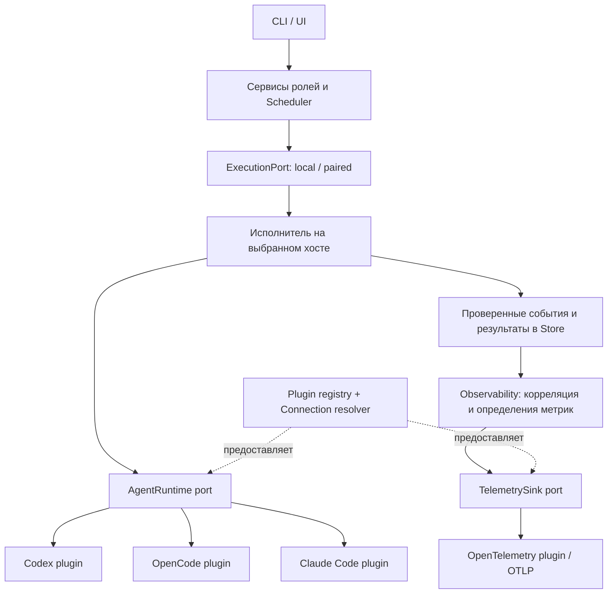

# Clew: архитектура плагинов и план внедрения

Статус: предложение. Дата: 2026-09-09. Номер релиза пока не назначен.

Решение по объёму от 2026-09-11: первый объём нарезан карточками CLEW-127–133 и выполняется параллельно со Scout и storage. Из этого объёма исключены: Claude Code (этап P3 целиком), marketplace и hot reload, метрики и log export (P6), live smoke внешних CLI (проверка только на fixtures/fake/unit) и конструктор workflow. Телеметрия ограничена выделением существующего traces-потока в `TelemetrySink` (P5). PricingSource, TerminalLauncher, WorkspaceOpener и ChangeViewer остаются вне эпика.

Цель: внутренние сервисы Clew работают через стабильные интерфейсы интеграций. Плагины реализуют эти интерфейсы для конкретных CLI, API и внешних систем. Добавление ещё одного исполнителя агента не требует менять scheduler, reviewer, architect и модель состояния задач.

Продуктовое направление (сверка 2026-09-10): пользователь подключает разные сервисы как отдельные плагины и собирает из этих блоков workflow под себя. Эта архитектура задаёт основу интеграций; UX настройки плагинов и конструктора workflow ещё предстоит описать. Формат конструктора и границы пользовательской настройки пока не определены. См. [сводку направлений](./DEVELOPMENT-DIRECTIONS.md).

Первый объём: общая инфраструктура плагинов, Codex CLI, OpenCode CLI/server, Claude Code CLI, единый выбор исполнителя для ролей и выделение существующего OpenTelemetry-экспорта. Далее — метрики, каталоги цен, редакторы и другие подключения. Это проектирование; описанные новые API и настройки ещё не реализованы.

## 1. Основа в текущем коде

| Сейчас                                                                                                                 | Изменение                                                                                                                |
| ---------------------------------------------------------------------------------------------------------------------- | ------------------------------------------------------------------------------------------------------------------------ |
| [harness.js](../src/harness.js): `FakeHarness`, `CodexHarness`, `OpenCodeHarness`, общие события                       | Сохранить поведение, разделить реализации по плагинам; события и ошибки вынести в общий контракт                         |
| [scheduler.js](../src/scheduler.js), [runner-execution.js](../src/runner-execution.js): повторяющиеся фабрики          | Получать исполнителя из общего resolver на соответствующем хосте                                                         |
| [architect.js](../src/architect.js), [review.js](../src/review.js): классы с привязкой к Codex                         | Общие сервисы ролей с передачей execution brief и схемы результата выбранному исполнителю                                |
| [domain.js](../src/domain.js), `PLAN_OUTPUT_SCHEMA`: фиксированный список harness                                      | Проверять формат идентификатора в контракте, а доступность — через registry при планировании и запуске                   |
| [control-service.js](../src/control-service.js), [config.js](../src/config.js): Codex/OpenCode diagnostics и настройки | Общие connection settings и `doctor`, проверка конкретного подключения внутри плагина                                    |
| [session-surface.js](../src/session-surface.js), [runtime.js](../src/runtime.js): Codex-команды и live endpoint        | Команды и протокол сессии принадлежат runtime-плагину; PTY, права владения и жизненный цикл терминала — Clew             |
| [execution-port.js](../src/execution-port.js): local/paired, leases и recovery                                         | Сохранить эту границу; плагины исполнения агентов находятся на стороне execution host                                    |
| [observability.js](../src/observability.js): события → OpenTelemetry traces → OTLP                                     | Отделить смысл событий, корреляцию и фильтрацию от SDK, exporter и подключения                                           |
| [usage.js](../src/usage.js), `syncPricing` в control service                                                           | Нативный разбор usage — в runtime-плагине; нормализация, стоимость и история — в ядре; загрузка прайсов — будущий плагин |
| [change-viewer.js](../src/change-viewer.js): готовые адаптеры редакторов                                               | Перерегистрировать через тот же механизм после основного перехода                                                        |

Особый случай миграции: локальные `createReviewerAdapter` и `createArchitectAdapter` сейчас выбирают fake для имени, отличного от Codex. В новой схеме fake доступен только по явной конфигурации тестового маршрута. Неизвестный, выключенный или несовместимый исполнитель возвращает диагностируемую ошибку.

## 2. Разделение понятий

| Понятие           | Ответственность                                                       | Пример                                              |
| ----------------- | --------------------------------------------------------------------- | --------------------------------------------------- |
| Plugin            | Версионируемый модуль, предоставляющий одну или несколько интеграций  | `clew.runtime.codex`                                |
| Adapter / port    | Контракт, который использует внутренний сервис                        | `AgentRuntime`, `TelemetrySink`                     |
| Connection        | Настроенный экземпляр интеграции на определённом хосте                | `codex-local`, `opencode-work`, `otel-main`         |
| Agent role        | Задача агента и правила проверки его результата                       | worker, architect, reviewer, qa                     |
| Runtime / harness | Среда исполнения агента, управляющая нативной сессией и инструментами | Codex CLI, OpenCode, Claude Code CLI                |
| Model selection   | Модель и допустимые параметры внутри выбранного runtime               | Идентификатор из его каталога, effort при поддержке |
| Execution host    | Где выполняются процесс и инструменты                                 | local host или paired Runner                        |

Единая настройка агента имеет вид `роль → подключение runtime → модель`. Один runtime может иметь несколько подключений. Список доступных моделей может зависеть от подключения и учётной записи; его нельзя считать общей константой Clew.

`AgentRuntime` принимает задание, окружение, политику, модель и возвращает события, результат и usage. Это шире, чем `generate(messages)`: CLI управляют сессиями, инструментами и запросами разрешений.

Если позже внутреннему сервису потребуется прямой вызов модели без агентской сессии, добавляем отдельный `ModelProvider` с операциями генерации/структурированного вывода. Embeddings — отдельная capability. В первом объёме такой клиент не нужен: Clew продолжает использовать нативные агентские циклы.

Плагины Clew и плагины, skills или MCP-серверы внутри нативного агента — разные уровни. Первый подключает исполнителя к Clew; второй расширяет инструменты самого исполнителя.

## 3. Схема зависимостей



Сервис получает готовый port через constructor injection. Registry используется в точке сборки приложения, а не становится глобальным объектом, доступным всем сервисам. Resolver проверяет connection, версию, доступность и требования конкретного запуска.

Плагин **сам реализует адаптер**. Дополнительная универсальная обёртка с `execute(type, payload)` не нужна. У исполнения агента, экспорта телеметрии и загрузки прайсов разные контракты и правила отказа. Общими остаются регистрация, конфигурация, диагностика и жизненный цикл.

Ядро сохраняет Task Contract, DAG, state machine, retry policy, approvals, leases, audit log, verification/review gates, Git provenance и finalization. Плагин возвращает данные через port; произвольного доступа к `Store`, SQL и смене task state у его API нет.

## 4. Минимальная инфраструктура плагинов

Manifest содержит `id`, `version`, `apiVersion`, предоставляемые extension points с их версиями, `configSchema`, область исполнения (`controller` или `execution-host`) и декларацию необходимых ресурсов. Совместимость версии Clew, Plugin API и версии внешнего CLI проверяется раздельно.

Жизненный цикл:

1. Прочитать manifest и проверить конфигурацию без запуска внешнего CLI и без сетевых запросов.
2. Зарегистрировать уникальные plugin ID и подключения. Коллизии ID — ошибка, порядок загрузки не решает конфликт.
3. По запросу выполнить `probe`: binary/endpoint, версия, состояние авторизации, доступные capabilities. Авторизацию не менять.
4. Создать connection-scoped адаптер и получить его для конкретного запуска. Изменяемое состояние запусков изолировано по `runId`.
5. При shutdown прекратить приём новой работы, ограниченно дождаться завершения/flush и освободить только собственные ресурсы.

Состояния подключения: `disabled`, `unconfigured`, `ready`, `unavailable`, `incompatible`. Ошибка одного необязательного подключения не мешает старту Clew; запуск, явно использующий его, отклоняется с причиной.

Первый релиз загружает доверенные bundled ESM-модули из явного списка в composition root. Форма API: обычный JavaScript, JSDoc, runtime validators и версионируемые JSON Schema, в соответствии с [ADR-0001](./adr/0001-toolchain.md). Установка произвольных пакетов, marketplace, hot reload и произвольный frontend-код расширений — отдельный этап после стабилизации контракта.

Проект может выбирать разрешённые подключения и модели. Пути загружаемых модулей, исполняемые файлы, credentials и список разрешённых подключений задаёт конфигурация владельца execution host. Новый plugin-конфиг из репозитория не получает право загружать код или расширять host policy. Изменение приоритета старых project-level binary settings должно иметь явную диагностику при миграции.

Декларация ресурсов у bundled-плагина — контракт и средство диагностики, а не sandbox: ESM-код в одном процессе технически обладает правами процесса. Для стороннего кода понадобится отдельный процесс и ограниченный RPC; реальная изоляция filesystem/network потребует механизмов ОС. Это не условие для выделения собственных адаптеров сейчас.

## 5. Контракт AgentRuntime

Минимальная форма API; точные JSON Schema фиксируются на первом этапе:

```text
runtime.describe()               → identity + поддерживаемые операции
runtime.probe(context)           → диагностика конкретного connection
runtime.run(request, hooks)      → Promise<RuntimeResult>
runtime.inspect(sessionRef)      → optional: состояние без нового запуска
runtime.reconcile(checkpoint)    → optional: классификация после потери связи
runtime.prepareSurface(request)  → optional: спецификация native UI / resume
runtime.listModels(context)      → optional: каталог этого подключения
runtime.dispose()                → освобождение собственных ресурсов
```

`run` получает `runId`, `operationId`, `task/stage/attempt`, execution brief, workspace, role, model selection, permission policy, output schema, execution mode и необязательный `resumeSessionRef`. `hooks` передаёт `AbortSignal`, `onEvent`, `onCheckpoint` и `requestApproval`. Параметры native API остаются внутри плагина; редкие дополнительные параметры допускаются только под его namespace и проходят его schema validation.

`RuntimeResult` возвращает terminal status, session/turn references, output, evidence candidates, нормализованный usage и диагностируемую ошибку при её наличии. Native completion само по себе не является успешной verification или завершением Task. Проверки результата принадлежат ядру.

Правила контракта:

- Все события имеют correlation с run/stage/attempt, тип, версию и идентификатор для дедупликации; native IDs сохраняются при наличии. Core проверяет привязку, размер и схему до записи. Повторные и запоздалые события не меняют завершённый run и не удваивают usage.
- `onCheckpoint` подтверждается после durable-записи session identity. Если native API позволяет, плагин ждёт подтверждения до запуска изменяющего workspace turn. Если ID становится известен только после старта, потеря связи до checkpoint считается неоднозначной, без автоматического повторного исполнения.
- Отмена через signal требует native interrupt/abort либо остановки принадлежащего плагину процесса. Неподтверждённая отмена означает необходимость recovery; она не выдаётся за доказанную остановку.
- `reconcile` возвращает `running`, `completed`, `stopped` или `unknown` с доказательствами. Если поддержка отсутствует, ядро выбирает явное восстановление. Повторно запускать потенциально работающего агента запрещено.
- Потоки progress могут объединяться с явным указанием пропусков; checkpoint, approval и terminal result не теряются молча. Очереди и размеры вывода ограничены.
- Разрешения сопоставляются без расширения: если плагин не способен обеспечить требуемую политику, запуск недоступен. Prompt «не изменяй файлы» не считается техническим read-only ограничением.
- `RuntimeError` содержит стабильный код, безопасное сообщение и класс ошибки: configuration, authentication, incompatible, unsupported capability, timeout, protocol error или execution failure. Решение о retry принимает ядро с учётом checkpoint и возможных побочных эффектов.

### Возможности зависят от режима

Capability — обещание конкретной протестированной операции для версии CLI, подключения и режима. Наличие TUI не означает наличие программного API для подтверждения разрешений; поддержка `resume` не означает возможность присоединиться к активному writer.

| Capability                                               | Как используется                                                                      |
| -------------------------------------------------------- | ------------------------------------------------------------------------------------- |
| `execution.headless`, `execution.interactive`            | Выбор способа запуска                                                                 |
| `session.resume`, `session.inspect`, `session.reconcile` | Продолжение и восстановление                                                          |
| `interaction.approval`, `interaction.userInput`          | Доступность ввода и approvals в выбранном режиме                                      |
| `policy.readOnly`                                        | Допуск к роли с обязательным ограничением записи                                      |
| `output.structured`                                      | Native schema output или извлечение с обязательной проверкой; способ указывается явно |
| `surface.open`, `surface.attach`                         | Открытие сохранённой сессии и подключение к активной сессии проверяются отдельно      |
| `usage.reported`, `models.list`                          | Доступность usage и каталога; отсутствие данных показывается явно                     |

Reviewer и architect требуют структурированного результата и read-only policy. Если runtime не предоставляет native schema output, допустим режим извлечения и проверки JSON при явно заявленной поддержке; невалидный результат идёт в существующую ветку ошибки/needs-human. Успешность не подменяется fake-ответом.

Роли формируют prompts, execution briefs и схемы внутри Clew. Они не становятся плагинами только из-за выбора модели. Для qa остаётся тот же runtime port, а критерии доказанности QA задаёт политика ядра.

### Три первых runtime-плагина

| Плагин      | Основа подключения                                                    | Граница первой реализации                                                                                                                            |
| ----------- | --------------------------------------------------------------------- | ---------------------------------------------------------------------------------------------------------------------------------------------------- |
| Codex       | Существующий `codex app-server` и существующий интерактивный CLI flow | Сохранить текущие execution, approval, terminal и `Finish worker` сценарии; убрать Codex-specific создание endpoint и команд из сервисов             |
| OpenCode    | Существующий server API и поток событий                               | Сохранить worker flow; добавить необходимые контракты ролей и проверить поддержку ограничений/структурированного вывода                              |
| Claude Code | Программный режим `claude -p` и JSON/stream JSON                      | Запуск, результат, usage, отмена и продолжение по конкретному session ID; интерактивность и approval bridge включать только после проверки протокола |

Codex документирует двусторонний App Server protocol, OpenCode — HTTP API и SSE, Claude Code — программный CLI с JSON, потоковым выводом и продолжением сессий. Эти различия скрываются плагинами. Основания: [OpenAI Docs: App Server](https://learn.chatgpt.com/docs/app-server), [OpenCode Server](https://opencode.ai/docs/server/), [Claude Code: programmatic execution](https://code.claude.com/docs/en/headless).

Документация определяет кандидатов для реализации, а не подтверждает готовую совместимость Clew. Перед объявлением capability нужны проверенная версия CLI, fixtures протокола и live smoke. Текущие границы совместимости Codex/OpenCode в репозитории сохраняются до отдельной проверки; версию Claude Code фиксирует первый compatibility spike.

На один workspace/run сохраняется один writer. Открытие терминала не создаёт конкурирующий headless-запуск. Владение PTY и разрешение на продолжение контролирует Clew; плагин знает, как открыть конкретный CLI.

## 6. Конфигурация и сохранённые запуски

Пример предлагаемого project config — имена подключений относятся к заранее настроенным подключениям на execution host:

```json
{
  "agents": {
    "worker": { "connection": "opencode-work", "model": null },
    "architect": { "connection": "codex-work", "model": null },
    "reviewer": { "connection": "claude-work", "model": null },
    "qa": { "connection": "codex-work", "model": null }
  },
  "observability": {
    "connections": ["otel-main"]
  }
}
```

`model: null` означает выбранный default данного runtime. Конкретный model ID проверяется в контексте connection; native значение, реально выбранное при исполнении, записывается отдельно. Нельзя молча заменить недоступную модель. Effort и другие параметры валидируются по capabilities runtime/model; одинаковое имя настройки не гарантирует одинаковую семантику.

На execution host connection связывает `id`, `plugin`, `enabled`, plugin-specific `config` и ссылки на credentials. Секреты разрешаются на этом хосте; в Controller, историю и UI попадает только безопасная проекция. Сам login остаётся нативным там, где CLI его уже предоставляет.

Приоритет выбора runtime: явный override запуска/стадии → настройка роли → профиль/default. Для конфигурации значения одного уровня разрешаются по текущему порядку flags → environment → project → user → defaults, в пределах host policy. Совместное задание конфликтующих старого `--harness` и нового `--connection` — ошибка с объяснением. Модель, унаследованная для другого connection, автоматически не переносится.

На каждый run до исполнения сохраняется immutable binding: plugin ID/version, Plugin API version, connection ID, execution host, версия CLI/протокола, capability snapshot, выбранная модель/параметры, безопасный config fingerprint. Session reference включает runtime, connection, host и native session ID; он не переносится между Codex, OpenCode и Claude Code.

Изменение настроек применяется к новым runs. Обновление/выключение плагина не меняет активный run: старый экземпляр доживает до завершения, новые запуски блокируются при disable. После рестарта совместимость сохранённого binding проверяется заново; отсутствие нужной версии или несовместимость означает recovery required. Автоматическое переключение на другой runtime не допускается. Новый runtime может получить контекст задачи как новый run, но это не продолжение native session.

## 7. Controller и Runner

Registry существует на каждом хосте. Runtime-плагин и его credentials находятся там, где выполняется агент. Controller выбирает разрешённое логическое подключение, а Runner повторно проверяет его наличие, policy и capabilities до принятия работы.

Для нового wire-контракта предлагается Runner protocol v2: безопасный inventory runtime-подключений в registration и binding/требования в lease offer. Следует обновить schemas, allowlists, negotiation и fixtures вместе. Старый Runner v1 остаётся на прежнем legacy-маршруте; маршруты новых плагинов на нём явно недоступны. Допуск mixed product versions остаётся отдельным решением текущей compatibility policy.

Существующие lease ID/epoch, stale-message fencing и запрет автоматического дублирования работы сохраняются. Не требуется новый scheduler для нескольких Runner, доставка модулей с Controller или передача native credentials. Нативные процессы и terminal surfaces остаются Runner-local в paired mode.

Телеметрия может экспортироваться с обоих хостов: Controller владеет метриками task lifecycle, Runner — локальными execution/process signals. Correlation передаётся разрешёнными полями. Получение Controller события от Runner не создаёт второй экземпляр той же execution-метрики.

## 8. Телеметрия, метрики и экономика

Да, это подходящая область для плагинов. Разделение ответственности:

| Ядро Clew                                                            | Плагин                                                            |
| -------------------------------------------------------------------- | ----------------------------------------------------------------- |
| Определяет смысл событий, spans, метрик, единицы измерения и labels  | Реализует подключение и доставку в поддерживаемую внешнюю систему |
| Хранит usage, task history, pricing snapshots и связь с run/revision | Runtime-плагин переводит native usage в канонические поля         |
| Рассчитывает стоимость и продуктовые показатели                      | Pricing-плагин получает каталог цен с provenance                  |
| Фильтрует данные, управляет consent, sampling и корреляцией          | Telemetry-плагин обслуживает SDK, exporter и собственную очередь  |

Первый `TelemetrySink` получает очищенные записи instrumentation от `Observability` через `emit(record)`, предоставляет `status()`, ограниченные по deadline `flush()`/`dispose()`. Записи различают trace lifecycle, metric observations и log records; это внутренний versioned envelope, а не новая замена OTLP. OTel-плагин использует официальный SDK для построения и экспорта сигналов, без ручной реализации wire protocol. Trace context и семантические определения остаются совместимыми с OpenTelemetry.

На первом этапе OTel-плагин переносит существующий traces flow и поддерживает прежние настройки endpoint/enable. Следующий этап добавляет metrics; log export подключается отдельно, существующие локальные диагностические логи продолжают работать. OpenTelemetry различает [traces, metrics и logs](https://opentelemetry.io/docs/concepts/signals/).

Рекомендуемый путь расширения: `Clew → OTel plugin → OTLP → Collector или совместимый backend`. Collector уже умеет принимать, обрабатывать и отправлять данные в разные системы; отдельный Clew-плагин на каждый dashboard не требуется. Специализированный exporter нужен при конкретной несовместимости или особом API. [OpenTelemetry Collector](https://opentelemetry.io/docs/collector/).

Правила надёжности и данных:

- Telemetry выключена по умолчанию. Отправка prompt, кода, tool output и секретов в стандартный поток запрещена; экспортируются разрешённые metadata.
- У каждого sink отдельная ограниченная очередь, timeout и backoff. Переполнение и ошибки видны в локальной диагностике; состояние задачи и обязательные проверки от этого не меняются. Зависший exporter не удерживает shutdown бесконечно.
- `try/catch` изолирует обычные ошибки bundled-плагина, но не гарантирует выживание процесса при произвольном сбое ESM-модуля. Защита от таких сбоев — отдельный процесс на этапе сторонних плагинов.
- Canonical events и usage сначала сохраняются. Telemetry — производная доставка; она может потерять данные при crash и не используется как единственный источник аудита или биллинга. Гарантия exactly-once внешнего экспорта не заявляется.
- Replay событий после рестарта не увеличивает счётчики повторно: projector использует durable cursor/дедупликацию и сохранённые агрегаты. Для runtime observations определяется один хост-владелец.
- `taskId`, `runId`, session ID и пути допустимы в разрешённых trace metadata, но не в labels обычных метрик. Labels ограничены ролью, runtime, профилем и классом результата; модели требуют ограничения количества значений.
- Unknown usage остаётся `null/unknown`, частичный — `partial`. Нативные cumulative counters преобразуются в приращения с checkpoint; cache/reasoning категории нормализуются без двойного учёта. Дедупликация учитывает run и native turn/message ID.
- Стоимость по каталогу помечается как calculated и привязана к immutable pricing snapshot. Она не объявляется фактическим списанием подписки; reported cost хранится отдельно при наличии.

Начальный набор метрик: длительность run/stage, ожидание пользователя, число retries, ошибки по runtime/классу, активные runs, reported tokens и полнота usage. Продуктовые success/rework rates вычисляются по каноническим результатам и явно определённой выборке; менять их смысл внутри exporter нельзя.

## 9. Для чего ещё делать плагины

Это точки расширения по мере появления потребности. Реализовывать все интерфейсы заранее не требуется.

| Приоритет                  | Extension point                  | Возможные реализации                                                                      | Что остаётся в ядре                                                      |
| -------------------------- | -------------------------------- | ----------------------------------------------------------------------------------------- | ------------------------------------------------------------------------ |
| Первый объём               | `AgentRuntime`                   | Codex, OpenCode, Claude Code; fake для тестов                                             | Роли, orchestration, approvals, validation                               |
| Первый объём               | `TelemetrySink`                  | OTel/OTLP, тестовый sink                                                                  | Семантика, correlation, privacy, canonical данные                        |
| Следом                     | `PricingSource`                  | Существующий HTTP JSON-каталог, локальный каталог                                         | Snapshots, расчёт, provenance, политика stale данных                     |
| Следом                     | `TerminalLauncher`               | Terminal.app, iTerm2, Ghostty, Windows Terminal                                           | Выбор session/run, безопасные argv/cwd, права и владение PTY             |
| Следом                     | `WorkspaceOpener`                | Cursor, VS Code, IDE JetBrains                                                            | Выбор workspace, execution-host policy и допустимость открытия           |
| Следом                     | `ChangeViewer`                   | Встроенный diff, GitHub Desktop, Fork, Tower, Sublime Merge, Kaleidoscope, Beyond Compare | Выбор run и точного диапазона изменений, read-only policy                |
| По интеграционному запросу | `IssueSource` / `IssuePublisher` | GitHub Issues, Linear, Jira                                                               | Task Contract; чтение и запись разрешаются отдельно                      |
| По интеграционному запросу | `RepositoryHosting`              | GitHub/GitLab PR, Checks, CI status                                                       | Локальный Git/worktree, финализация и разрешение на merge/push           |
| По развитию evidence       | `EvidenceSource`                 | CI, JUnit, Playwright reports, внешнее review                                             | Привязка к revision, проверка подлинности/происхождения, acceptance gate |
| По интеграционному запросу | `NotificationSink`               | Webhook, мессенджер, desktop notification                                                 | Правила уведомлений; delivery outbox и idempotency                       |
| Позже                      | `ArtifactStore`                  | Local filesystem, S3-compatible storage                                                   | Метаданные, checksum, ownership и retention policy                       |
| Позже                      | `EnvironmentProvider`            | Контейнер или удалённая execution environment                                             | Lease, workspace ownership, разрешения и жизненный цикл                  |
| Позже                      | `ContextSource` / `ToolProvider` | Документация, поиск, MCP-инструменты                                                      | Выбор контекста, происхождение, права доступа                            |

Один GitHub-плагин может предоставлять issue intake, repository hosting и evidence source как разные порты. Один и тот же registry может обслуживать их без превращения всех операций в общий RPC payload.

### Desktop-поверхности

Внешний терминал, IDE и просмотр изменений — три разных подключения:

- `TerminalLauncher` открывает интерактивную native-сессию в выбранном терминале. Runtime-плагин знает, как возобновить Codex/OpenCode/Claude Code, а launcher знает, как безопасно запустить argv в Terminal.app, iTerm2, Ghostty или другой программе на execution host.
- `WorkspaceOpener` открывает конкретный worktree в IDE или редакторе. Первый набор может сохранить существующие Cursor и VS Code и добавить IDE JetBrains. Это не означает показ точного task diff.
- `ChangeViewer` получает baseline/result revision, workspace и безопасное описание файлов и открывает именно изменения выбранного run. Возможности объявляются явно: `working-copy`, `revision-range`, `patch`, `file-pair`, `merge-conflict`.

Разделение важно для чистого worktree: Git-клиент, которому передали только путь, может не показать уже закоммиченные изменения. Для обещания «открыть изменения» adapter должен поддерживать диапазон baseline → result или принять подготовленный patch. Если доступно только открытие repository/worktree, UI называет действие «Open workspace», а не «Open changes».

Наиболее узнаваемые кандидаты для адаптеров:

- [GitHub Desktop](https://docs.github.com/en/desktop/overview/about-github-desktop) — бесплатный open-source Git GUI для macOS и Windows;
- [Fork](https://git-fork.com/) — Git-клиент для macOS и Windows;
- [Tower](https://www.git-tower.com/features/all-features/) — Git-клиент с worktrees, branch compare и встроенным diff;
- [Sublime Merge](https://www.sublimemerge.com/) — кроссплатформенный Git-клиент с side-by-side diff и line staging;
- [Kaleidoscope](https://kaleidoscope.app/) — специализированный macOS diff/merge viewer с Git changesets;
- [Beyond Compare](https://www.scootersoftware.com/) — кроссплатформенный инструмент сравнения и merge.

Рекомендуемый порядок после выделения интерфейсов: сохранить встроенный diff и Cursor/VS Code как совместимый baseline; добавить один полноценный Git GUI adapter (Fork или Tower на macOS, GitHub Desktop как бесплатный массовый вариант); затем специализированный diff adapter для Kaleidoscope. Конкретный порядок требует smoke-проверки запуска точного revision range, а не только открытия каталога.

Не выносить сейчас в плагины SQLite/event store, Task state machine, проверку критериев, approvals и completion policy. Для них важнее единый набор инвариантов. UI строится из безопасного каталога connections/capabilities и декларативных настроек, без исполнения предоставленного плагином кода.

## 10. Этапы реализации и критерии выхода

| Этап                                   | Работы                                                                                                         | Критерий выхода                                                                                                                            |
| -------------------------------------- | -------------------------------------------------------------------------------------------------------------- | ------------------------------------------------------------------------------------------------------------------------------------------ |
| P1. Контракты                          | Plugin API v1, AgentRuntime v1, registry, resolver, fake plugin, безопасная конфигурация, schema fixtures      | Неизвестный ID, дубли, несовместимая версия и неподдержанная capability возвращают явную ошибку; fake работает только явно                 |
| P2. Существующие runtime               | Перенос Codex/OpenCode; общие сервисы ролей; diagnostics; model routing; session surfaces; usage normalization | Сохранены текущие поддерживаемые сценарии; scheduler/роли не импортируют конкретные runtime; нет нового writer при открытии terminal       |
| P3. Claude Code                        | Compatibility spike; CLI adapter; результаты, usage, interrupt, explicit-session resume; role matrix           | Claude подключается через собственный модуль и регистрацию без изменений доменных сервисов; live smoke подтверждает заявленные возможности |
| P4. Persistence и paired               | Binding snapshots, migration старых runs, Runner v2 inventory/lease fields, restart/recovery                   | Local и paired дают эквивалентные канонические результаты; crash/повтор сообщения не создаёт дублирующий run                               |
| P5. Второе семейство                   | Выделение OTel traces в plugin, test sink, статус подключения и legacy config bridge                           | Одна инфраструктура обслуживает runtime и telemetry; отказ/отключение экспорта не влияет на execution и историю                            |
| P6. Метрики и существующие подключения | Metrics projector, OTLP metrics, PricingSource, TerminalLauncher, WorkspaceOpener и ChangeViewer               | Метрики не удваиваются после replay; терминал, IDE, pricing и viewer меняются без правок вызывающих сервисов                               |

Порядок: P1 → P2 → P3 → P4 → P5. P1–P5 — первый завершённый объём; P6 — следующая итерация. Возможности будущих систем из раздела 9 не блокируют эти этапы. Детальные task cards создаются при назначении релиза, с criterion-specific evidence согласно [процессу задач](../tasks/README.md).

### Миграция без переписывания всех сервисов сразу

1. Оставить compatibility facade в `harness.js`, чтобы потребители переходили постепенно; реализации переместить за новый API.
2. Старые `--harness codex|opencode|fake`, `models.*`, `codexBin`, `openCodeUrl`, telemetry config преобразовывать в явные legacy connections. Не менять разрешения и runtime по умолчанию молча.
3. Старые session IDs связывать с известным историческим harness/host. Неизвестную версию/модель отмечать как legacy unknown; не приписывать ей текущую версию плагина.
4. Историю и сохранённые v1 документы продолжать читать. При изменении shape публиковать v2 schema и поддерживать v1 reader. Список разрешённых runtime проверять в resolver, не в глобальном enum; schema для генерируемого плана может содержать динамический список разрешённых в конкретном запуске ID.
5. Перевести diagnostics и UI на registry; показывать причину недоступности требуемого режима. Не обещать одинаковые capabilities трёх CLI.
6. Удалять старые фабрики только после перехода local, paired, role и session consumers. Совместимые CLI aliases можно сохранить дольше внутреннего facade.

### Проверка результата

Существующий [harness conformance suite](../test/harness-conformance.test.js) становится общим набором контрактных проверок для bundled runtime. Проверки отражают поведение, а не расположение методов.

Обязательные сценарии: quick/standard/deep; worker/architect/reviewer/qa там, где capability заявлена; start/resume/interrupt/approval; отсутствующий binary/login; неподдержанная модель; невалидный structured output; неполный JSON/SSE; timeout; дубли событий/usage; рестарт до/после checkpoint; несовместимая версия/выключенный plugin; один writer; local/paired и устаревший lease epoch. Неподдержанные комбинации проверяются как явный отказ до исполнения.

Telemetry проверяется выключенной, со здоровым test collector, при отказе, переполнении, зависшем exporter и replay. Проверяются redaction, ограничение labels, сохранение usage независимо от доставки и отсутствие зависимости task state от telemetry.

Для каждой native реализации: deterministic protocol fixtures в CI и отдельный live smoke на зафиксированной версии CLI с доступной авторизацией. Общие обязательные проверки репозитория выполняются перед завершением реализации; один только fake smoke не подтверждает совместимость native CLI.

Практический критерий архитектуры: четвёртый runtime добавляется своим модулем, manifest, регистрацией и conformance fixtures. Scheduler, reviewer, architect, task lifecycle и UI не получают новых веток по его имени. Второй telemetry sink также добавляется без правок доменных сервисов.
